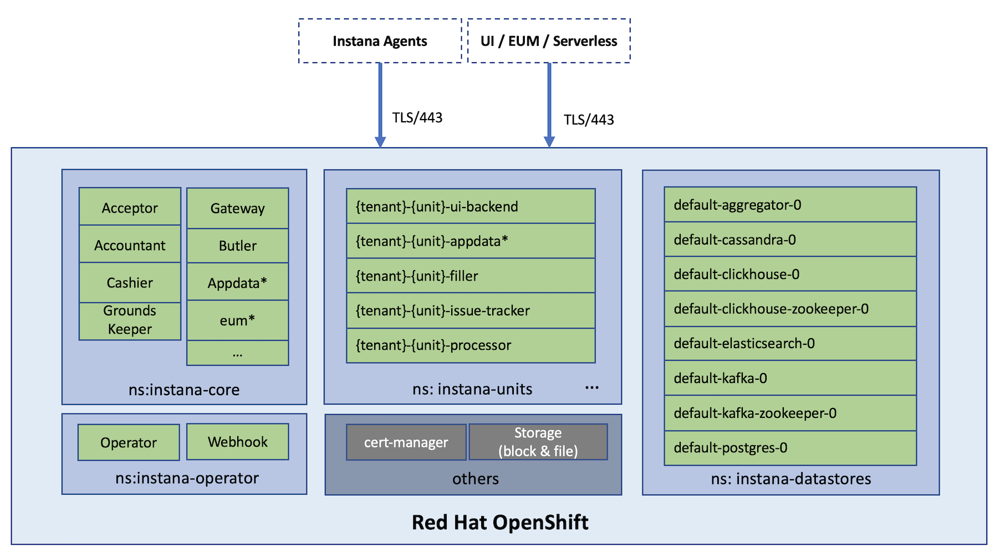

# Deploying Instana on OpenShift / ROKS Cluter

This repository guides you through how to set up Instana on a given ROKS cluster.

The architecture can be illustrated as below:



## Prerequisites

### Tools

A series tools will be needed, which include:
- `oc`
- `kubectl`
- `openssl`
- `curl`
- Instana kubectl plugin. Please visit the doc [here](https://www.ibm.com/docs/en/instana-observability/current?topic=premises-instana-kubectl-plug-in#manual-installation) to download the right `kubectl` plugin, with the desired version, and install it properly.
- [`yq`](https://github.com/mikefarah/yq)

## The TL'DR guide

You may run it in your Mac, or a Linux machine.

**Make sure you've already logged into OpenShift with ClusterAdmin permission.**

### 0. Prepare

```sh
# Clone the repo
git clone https://github.com/brightzheng100/instana-server-on-k8s.git
cd instana-server-on-k8s/all-in-roks

# Make a directory for hosting some working files, which will be ignored by Git
mkdir _wip

# Export required environment variables
export INSTANA_EXPOSED_FQDN="instana.`oc get ingresses.config/cluster -o=jsonpath='{.spec.domain}'`"    # or your desired FQDN
export INSTANA_AGENT_KEY="<THE LICENSE'S AGENT KEY>"
export INSTANA_DOWNLOAD_KEY="<THE LICENSE'S DOWNLOAD KEY>"
export INSTANA_SALES_KEY="<THE LICENSE'S SALES KEY>"
```

Optionally, you may export more environment variables to influence the installation if that makes sense -- the process will respect the desired changes you want to make.

Please refer to [`scripts/13-init-vars.sh`](./scripts/13-init-vars.sh) for the potential environment variables that can be exported.

For example, to change the default Instana console login password, do something like this:

```sh
export INSTANA_ADMIN_PWD=MyCoolPassword
```

Or, to use another desired version of Instana, if available, do something like this:

```sh
export INSTANA_VERSION=243-5
```

And, quite importantly, you have to take care of the StorageClasses for a list of persistence components.
- For normal datastore components, like `DATASTORE_STORAGE_CLASS_CASSANDRA`, use block storage;
- For `DATASTORE_STORAGE_CLASS_SPANS`, you must set the StorageClass that supports `ReadWriteMany` in a real-world multi-node cluster!

So get ready and export them accordingly to fit into your OpenShift context -- here I use `ibmc-file-gold-gid` as the file-based storage for `DATASTORE_STORAGE_CLASS_SPANS`, while `ibmc-block-gold` for the rest, both are available in ROKS Classic, on IBM Cloud.

```sh
export DATASTORE_SIZE_BEEINSTANA="10Gi"
export DATASTORE_STORAGE_CLASS_BEEINSTANA="ibmc-block-gold"
export DATASTORE_SIZE_CASSANDRA="10Gi"
export DATASTORE_STORAGE_CLASS_CASSANDRA="ibmc-block-gold"
export DATASTORE_SIZE_CLICKHOUSE="10Gi"
export DATASTORE_STORAGE_CLASS_CLICKHOUSE="ibmc-block-gold"
export DATASTORE_SIZE_CLICKHOUSE_ZK="2Gi"
export DATASTORE_STORAGE_CLASS_CLICKHOUSE_ZK="ibmc-block-gold"
export DATASTORE_SIZE_ELASTICSEARCH="10Gi"
export DATASTORE_STORAGE_CLASS_ELASTICSEARCH="ibmc-block-gold"
export DATASTORE_SIZE_KAFKA="2Gi"
export DATASTORE_STORAGE_CLASS_KAFKA="ibmc-block-gold"
export DATASTORE_SIZE_KAFKA_ZK="10Gi"
export DATASTORE_STORAGE_CLASS_KAFKA_ZK="ibmc-block-gold"
export DATASTORE_SIZE_POSTGRES="3Gi"
export DATASTORE_STORAGE_CLASS_POSTGRES="ibmc-block-gold"
export DATASTORE_SIZE_SPANS="10Gi"
export DATASTORE_STORAGE_CLASS_SPANS="ibmc-file-gold-gid"
```

Now, let's get started!

### 1. Init it

```sh
source 1-init-all.sh
```

### 2. Install Instana

Similarly, if you want to install Instana in one shot, do this:

```sh
./2-install-instana.sh
```

But, I'd highly recommend you do it step by step so you have better chance to troubleshoot.
So, run below commands, well, custom functions actually, one by one instead:

```sh
creating-namespaces
installing-cert-manager
# check before proceeding: wait 5 mins for expected 3 pods
check-namespaced-pod-status-and-keep-displaying-info "cert-manager" 5 3 "kubectl get pod -n cert-manager"
installing-instana-operator
installing-instana-datastores
# check before proceeding: wait 10 mins for expected 8 pods
check-namespaced-pod-status-and-keep-displaying-info "instana-datastores" 10 8 "kubectl get pod -n instana-datastores"

installing-instana-server-components-secret-image-pullsecret
installing-instana-server-components-secret-instana-core
installing-instana-server-components-secret-instana-tls
installing-instana-server-components-secret-tenant0-unit0

installing-instana-server-components-core
# check before proceeding: wait 15 mins for expected 20 pods
check-namespaced-pod-status-and-keep-displaying-info "instana-core" 15 20 "kubectl get pod -n instana-core"

installing-instana-server-components-unit
# check before proceeding: wait 10 mins for expected 6 pods
check-namespaced-pod-status-and-keep-displaying-info "instana-units" 10 6 "kubectl get pod -n instana-units"

exposing-instana-server-servies
```

### 4. How to access?

Once you've gone through all above steps successfully, the Instana should have been deployed.
Now, you can print out the access info:

```sh
how-to-access-instana
```

## Potential Issues & Solutions

### Authentication issue for ElasticSearch

If no pods are created in `instana-core` namespace, and you're seeing authentication issues in the operator logs, while accessing ElasticSearch:

```log
unable to authenticate user [elasticsearch_user] for REST request [/_cat/nodes?format=json&h=ip%2Cv]
```

We may need to reset the ElasticSearch superuser and create our configured one.

Exec into ElasticSearch pod:

```sh
kubectl exec -n instana-datastores -it default-elasticsearch-0 -- bash
```

```
bash-5.1$ pwd
/usr/share/elasticsearch

bash-5.1$ bin/elasticsearch-setup-passwords interactive

Please confirm that you would like to continue [y/N] y

Enter password for [elastic]: changeme
Reenter password for [elastic]: changeme
Enter password for [apm_system]: changeme
Reenter password for [apm_system]: changeme
Enter password for [kibana_system]: changeme
Reenter password for [kibana_system]: changeme
Enter password for [logstash_system]: changeme
Reenter password for [logstash_system]: changeme
Enter password for [beats_system]: changeme
Reenter password for [beats_system]: changeme
Enter password for [remote_monitoring_user]: changeme
Reenter password for [remote_monitoring_user]: changeme
Changed password for user [apm_system]
Changed password for user [kibana_system]
Changed password for user [kibana]
Changed password for user [logstash_system]
Changed password for user [beats_system]
Changed password for user [remote_monitoring_user]
Changed password for user [elastic]
```

Then create our configured user/password:

```sh
bash-5.1$ curl --user elastic:changeme -X POST "http://localhost:9200/_security/user/elasticsearch_user?pretty" -H 'Content-Type: application/json' -d'
{
  "password" : "elasticsearch_pass",
  "roles" : [ "superuser" ]
}
'
```

You should be able to see the creation result:

```json
{
  "created" : true
}
```
