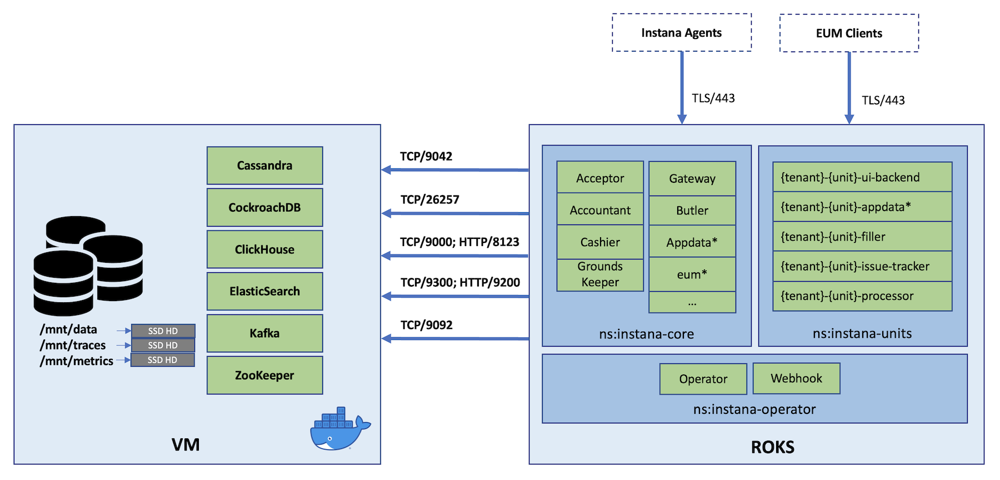

# Instana Server on ROKS, with VM-based Datastores

Instana offers SaaS by default, and also offers flexible non-SaaS deployment patterns, so we can deploy it within a single VM, dual-VM, or even Kubernetes.

TechZone is IBM's killer sandbox where IBMers and its Business Partners can easily provision a VM, a Kubernetes/OpenShift cluster, or even a very complex environment on demand for purposes like self-learning, POCs/POVs.
RedHat OpenShift Kubernetes Service (ROKS) is one of the most demanding services on IBM Cloud, which can be provisioned too through TechZone, on demand.

This doc offers an end-to-end guide for how to deploy Instana backend components on:

- 1 x ROKS cluster: 3 x Worker Nodes, each with 8vCPU, 32G RAM, and 100G Disk
- 1 x VM: 16vCPU, 64G RAM

> Note: In this experiment I used OCP v4.10.x and RHEL v8.6 but different versions may work too.

The architecture can be illustrated as below:




## Overview

Overall, there are two parts, once the [Infrastructure Preparation](#infrastructure-preparation) is done:

1. [Part 1 - Deploying Instana Datastore Components on VM](#part-1---deploying-instana-datastore-components-on-vm)
2. [Part 2 - Deploying Instana Backend Components on ROKS](#part-2---deploying-instana-backend-components-on-roks)


## Infrastructure Preparation

Please provision the ROKS cluster and VM with abovementioned specs before proceeding.
Both of these services can be found in TechZone.

Please reach out to #itz-techzone-support to open below ports for the VM:
- 9042 - Cassandra
- 26257	- CockroachDB
- 9000 - ClickHouse operations
- 8123 - ClickHouse healthcheck
- 9200 - ElasticSearch
- 9300 - ElasticSearch
- 9092 - Kafka


## Part 1 - Deploying Instana Datastore Components on VM

Please SSH into the VM for all below steps, with a user who can be `root` or a user with `sudo` permission.

### Preparation for Part 1

**1. Determine the use the right version of Instana with right `instana-console`**

You MUST install the proper version of `instana-console` to align the datastore components' versions with the ones required by `kubectl instana --version` in part 2, to avoid version mismatch. 

So you should install Instana's `kubectl` plugin first, by following [this step](#installing-kubectl-plugin), and determine which version of `instana-console` should be installed in part 1.
Otherwise a re-installation of Instana Datastore components might be required.

Please see [Error: version requirements not met](#error-version-requirements-not-met) in the known issues for details.

This is to make sure we're setting the proper `INSTANA_VERSION` variable.

**2. Expose the datastore VM properly**

There might be different scenarios while exposing the datastore VM:
- Public IP, or dummy FQDN with `.nip.io`. If you're on IBM Cloud classic VM, there will be both private and public IPs attached, so use directly the public IP is fine to set the `INSTANA_DATASTORE_HOST` variable, or use a dummy FQDN like `<IP>.nip.io` where the `<IP>` is exactly the public IP
- Private IP in VPC together with ROKS. In this case, since the private IP is accessible by the VPC-based ROKS, either using the private IP, or a dummy FQDN is totally fine
- Private IP in VPC while ROKS is outside of VPC. In this case, the floating IP might not be visible from the VM so you have to export the `INSTANA_DATASTORE_HOST` variable using the private IP, while using the dummy `.nip.io` FQDN to map to the floating IP.

Anyway, if you don't have a proper FQDN, do create a dummy one like this:

```sh
# The <IP> should be the one exposed to and accessed by the Instana backend components
# - Use public IP in classic datastore VM
# - Use private IP when both datastore VM and ROKS are in the same VPC
# - Use floating IP when datastore VM is in VPC while ROKS is outside of VPC
sudo hostnamectl set-hostname <IP>.nip.io
```

**3. Set and export the variables**

Okay, now please prepare and set ALL required variables:

```sh
# Set ALL required variables
export INSTANA_VERSION="<THE INSTANA VERSION, e.g. 235-1, see point 1 above>"
export INSTANA_DATASTORE_HOST="<THE FQDN OR IP OF THE VM, e.g. 168.1.53.253, see point 2 above>"
export INSTANA_AGENT_KEY="<THE INSTANA AGENT KEY>"

# Git clone the repo so that we have the scripts
git clone https://github.com/brightzheng100/instana-server-on-k8s.git
cd instana-server-on-k8s/roks-with-vm-based-datastores

# Make a temp folder which will be ignored by the Git
mkdir _wip
```

### The TL;DR Guide for Part 1

If you don't care about the details, clone the repo and run below commands within the repo's root folder:

```sh
sudo -E ./1-vm.sh
```

> Note: once you have successfully completed this "**The TL;DR Guide for Part 1**", please skip all steps in part 1 and proceed directly with [Part 2 - Deploying Instana Backend Components on ROKS](#part-2---deploying-instana-backend-components-on-roks). Or read on to see what exactly has been done within this TL;DL guide with step-by-step details.


### Installing Docker

```sh
# Remove potential lagecy components, if any
sudo dnf remove -y \
  docker \
  docker-client \
  docker-client-latest \
  docker-common \
  docker-latest \
  docker-latest-logrotate \
  docker-logrotate \
  docker-engine \
  podman \
  runc

# Add Docker repo
# As Docker CE is not officially supported on RHEL 8, we use CentOs repo here
sudo dnf config-manager --add-repo https://download.docker.com/linux/centos/docker-ce.repo

# Now install Docker components
sudo dnf install -y docker-ce docker-ce-cli containerd.io

# Start Docker daemon
sudo systemctl start docker

# Have a try and we should be able to see "Hello from Docker!"
sudo docker run hello-world

# Finally add our current user into "docker" group to avoid "sudo" while running docker CLI
# Re-login to the VM to take effect
sudo usermod -aG docker $USER
```

### Installing Instana CLI

```sh
sudo dnf update -y

cat <<EOF | sudo tee /etc/yum.repos.d/Instana-Product.repo
[instana-product]
name=Instana-Product
baseurl=https://self-hosted.instana.io/rpm/release/product/rpm/generic/x86_64/Packages
enabled=1
gpgcheck=1
repo_gpgcheck=1
gpgkey=https://self-hosted.instana.io/signing_key.gpg
priority=5
sslverify=1
#proxy=http://x.x.x.x:8080
#proxy_username=
#proxy_password=
EOF

sudo dnf makecache

# Check available versions and pick the right one
# You may see something like this:
#...
#instana-console.x86_64    233-2       instana-product
#instana-console.x86_64    235-0       instana-product
#instana-console.x86_64    235-1       instana-product
#instana-console.x86_64    235-2       instana-product
sudo dnf --showduplicates list instana-console

# Replace the <INSTANA-VERSION> with the right version
# For example: sudo dnf install -y instana-console-235-1
sudo dnf install -y instana-console-<INSTANA-VERSION>

instana version

sudo dnf install python3-dnf-plugin-versionlock -y
sudo dnf versionlock add instana-console
```

### Installing Instana Datastore Components

```sh
# Prepare the settings file
cat <<EOF | sudo tee _wip/db-settings.hcl
type        = "single-db"
host_name   = "${INSTANA_DATASTORE_HOST}"

dir {
  metrics   = "/mnt/metrics"     // data dir for metrics
  traces    = "/mnt/traces"      // data dir for traces
  data      = "/mnt/data"        // data dir for any other data
  logs      = "/var/log/instana" // log dir
}

docker_repository {
  base_url = "containers.instana.io"
  username = "_"
  password = "${INSTANA_AGENT_KEY}"
}
EOF

# Init and install the Instana datastore components
sudo instana datastores init -f _wip/db-settings.hcl
```

It will take some time as it has to download the desired Docker images and run them properly.

The output may look like this:

```log
Setup host environment ✓
Ensure images ✓
Check data directories ✓
Clean docker containers ✓
Run data stores ✓
```

Once it's done, the part 1 is completed and we can verify it by:

```sh
$ docker ps
CONTAINER ID   IMAGE                                                                         COMMAND                  CREATED          STATUS                    PORTS     NAMES
c7d824125c40   containers.instana.io/instana/release/product/cassandra:4.0.3_v0.51.0         "/docker-entrypoint.…"   13 minutes ago   Up 13 minutes (healthy)             instana-cassandra
3585d2b73c14   containers.instana.io/instana/release/product/clickhouse:22.3.12.19_v0.53.0   "/docker-entrypoint.…"   13 minutes ago   Up 13 minutes (healthy)             instana-clickhouse
31604a26c7d9   containers.instana.io/instana/release/product/elasticsearch:7.16.3_v0.47.0    "/docker-entrypoint.…"   13 minutes ago   Up 13 minutes (healthy)             instana-elastic
bf4502887e1e   containers.instana.io/instana/release/product/cockroachdb:21.1.7_v0.41.0      "/docker-entrypoint.…"   13 minutes ago   Up 13 minutes (healthy)             instana-cockroachdb
e9bcb35e15c6   containers.instana.io/instana/release/product/kafka:3.2.0_v0.57.0             "/docker-entrypoint.…"   13 minutes ago   Up 13 minutes (healthy)             instana-kafka
830bdba16b81   containers.instana.io/instana/release/product/zookeeper:3.7.1_v0.44.0         "/docker-entrypoint.…"   14 minutes ago   Up 14 minutes (healthy)             instana-zookeeper
```


## Part 2 - Deploying Instana Backend Components on ROKS

You may walk through these steps in your laptop, or anywhere you like, as long as you can access ROKS and have logged into it as `ClusterAdmin`, with the desired tools installed.

Overall there are 3 major steps:

1. [Preparation for Part 2](#preparation-for-part-2)
2. [Installing Instana Operator](#installing-instana-operator)
3. [Installing Instana Server Components](#installing-instana-server-components)

Once you have done the [Preparation for Part 2](#preparation-for-part-2), the doc also offers a [The TL;DR Guide for Part 2](#the-tldr-guide-for-part-2).


### Preparation for Part 2

#### Instana Datastore Readiness Check

Before you proceed, please have a check to make sure all required ports are opened.

For example:

```sh
# Change the IP to your actual Instana Datastore VM's IP
$ INSTANA_DATASTORE_HOST_IP="168.1.53.248" && \
  for port in {9042,26257,9000,8123,9200,9300,9092}; do
    nc -vz ${INSTANA_DATASTORE_HOST_IP} ${port}
  done
```

You should be able to see some output like this:

```log
Connection to 168.1.53.248 port 9042 [tcp/*] succeeded!
Connection to 168.1.53.248 port 26257 [tcp/*] succeeded!
Connection to 168.1.53.248 port 9000 [tcp/cslistener] succeeded!
Connection to 168.1.53.248 port 8123 [tcp/*] succeeded!
Connection to 168.1.53.248 port 9200 [tcp/wap-wsp] succeeded!
Connection to 168.1.53.248 port 9300 [tcp/vrace] succeeded!
Connection to 168.1.53.248 port 9092 [tcp/XmlIpcRegSvc] succeeded!
```

#### Installing `kubectl` plugin

Please visit the doc [here](https://www.ibm.com/docs/en/instana-observability/current?topic=premises-instana-kubectl-plug-in#manual-installation) to download the right `kubectl` plugin and install it properly.

For examppe, this is my process when installing it in my MBP with M1 chip laptop.

```sh
cd ~/Downloads
tar -xvf kubectl-instana-darwin_arm64-release-235-1.tar.gz
sudo cp kubectl-instana /usr/local/bin/
```

We can then verify that -- in my case, as shown below, it's on `235-1` version of Instana:

```sh
$ kubectl instana --version
kubectl-instana version 235-1 (commit=67a2128239e0d6321a164ac149064bd8c8791db4, date=2022-10-20T11:30:20Z, image=, branch=release)

Minimum required database versions:
beeinstana:         	Major:1 	min. Minor:160
cockroachdb:        	Major:21 	min. Minor:1
kafka:              	Major:3 	min. Minor:2
elasticsearch:      	Major:7 	min. Minor:16
cassandra:          	Major:4 	min. Minor:0
clickhouse:         	Major:22 	min. Minor:3
```

#### Install other required tools

There are some handy tools required as well.

Please install them accordingly:
- [oc](https://docs.openshift.com/container-platform/4.11/cli_reference/openshift_cli/getting-started-cli.html)
- [kubectl](https://kubernetes.io/docs/tasks/tools/)
- [yq](https://github.com/mikefarah/yq)
- openssl

#### Export ALL required variables

```sh
# Instana's agent key
export INSTANA_AGENT_KEY="<INSTANA AGENT KEY>"
# Instana's download key, it might be same as agent key
export INSTANA_DOWNLOAD_KEY="<INSTANA DOWNLOAD KEY>"
# Instana's sales key
export INSTANA_SALES_KEY="<INSTANA SALES KEY>"
# Instana's initial user for admin to log into UI
export INSTANA_ADMIN_USER="admin@instana.local"
# Instana's initial password for admin to log into UI
export INSTANA_ADMIN_PWD="Passw0rd"
# Instana's cert pass phrase, whatever you want to set
export INSTANA_KEY_PASSPHRASE="Passw0rd"
# RWX-based storage class for spans
export SPANS_STORAGE_CLASS="ibmc-file-gold-gid"
# Instana's datastore VM's FQDN, or exposed IP, refer to Preparation for Part 1
export INSTANA_DATASTORE_HOST_FQDN="<INSTANA DATASTORE VM'S FQDN OR EXPOSED IP, e.g 168.1.53.248.nip.io>"
```

### The TL;DR Guide for Part 2

The part 2 can be very verbose even I've streamlined a lot.
But you can try out the offered script too to make things easier.

After exporting the required abovementioned variables, we can run through these "commands", well, actually they're custom functions, line by line.

> Note: even we can run all these in some shot, I'd strongly recommend you do that command by command so that you have a better chance to fix the potential issues before proceeding. And you may need to wait for a while, or have a retry, between the commands as some commands really take some time to finish.

```sh
# Git clone the repo, if you haven't yet
git clone https://github.com/brightzheng100/instana-server-on-k8s.git
cd instana-server-on-k8s/roks-with-vm-based-datastores

# Source the file
source 2-roks.sh

# Run the commands line by line
installing-instana-operator
installing-instana-server-components-namespaces
installing-instana-server-components-image-pullsecret
installing-instana-server-components-secret-instana-core
installing-instana-server-components-secret-instana-tls
installing-instana-server-components-secret-tenant0-unit0
installing-instana-server-components-pvc-spans
installing-instana-server-components-core
installing-instana-server-components-unit
installing-instana-server-components-routes
```

It may take a while, say roughly 15-30 mins, to be fully ready and you should be able to see Pods created in both namespace "instana-core" and "instana-units".

How to access it? Try this:

```sh
$ how-to-access-instana-on-roks
```

> Note: once you have successfully completed this "The TL;DR Guide for Part 2", the installation of Instana on ROKS has been completely done. Read on only when you want to see how the detailed process looks like for part 2, or you really want to do that manually, step by step.

### Installing Instana Operator

#### Namespace

```sh
# Create namespace for Instana Operator
$ kubectl create namespace instana-operator
```

#### Secret

```sh
# Create the secret
$ kubectl create secret docker-registry instana-registry \
    --namespace=instana-operator \
    --docker-username=_ \
    --docker-password="${INSTANA_AGENT_KEY}" \
    --docker-server=containers.instana.io
```

#### Installing Cert Manager

You may follow OpenShift's [official doc](https://docs.openshift.com/container-platform/4.10/security/cert_manager_operator/cert-manager-operator-install.html) to install [`cert-manager-operator`](https://cert-manager.io/docs/) instead.
But for simplicity, let's try this one-liner installation of Cert Manager.

```sh
$ kubectl apply -f https://github.com/cert-manager/cert-manager/releases/download/v1.9.1/cert-manager.yaml
```

#### Installing Operator itself

```sh
### Create a _wip folder to host temp files which will be ignored by Git
mkdir _wip

# Prepare necessary customization
$ cat > _wip/instana-operator-values.yaml <<EOF
imagePullSecrets:
  - name: instana-registry
EOF

# Optionally, generate the yaml files for learning purposes
# kubectl instana operator template --output-dir _wip/operator --values _wip/instana-operator-values.yaml

# Apply the Instana Operator
$ kubectl instana operator apply \
  --namespace=instana-operator \
  --values _wip/instana-operator-values.yaml
```

A series of objects will be created:

```log
namespaces/instana-operator updated
serviceaccounts/instana-operator created
serviceaccounts/instana-operator-webhook created
customresourcedefinitions/cores.instana.io created
customresourcedefinitions/datastores.instana.io created
customresourcedefinitions/units.instana.io created
clusterroles/instana-operator created
clusterroles/instana-operator-webhook created
clusterrolebindings/instana-operator created
clusterrolebindings/instana-operator-webhook created
roles/instana-operator-leader-election created
rolebindings/instana-operator-leader-election created
services/instana-operator-webhook created
deployments/instana-operator created
deployments/instana-operator-webhook created
certificates/instana-operator-webhook created
issuers/instana-operator-webhook created
validatingwebhookconfigurations/instana-operator-webhook-validating created
```

### Installing Instana Server Components

#### Namespaces: `instana-core` and `instana-units`

Create two namespaces:
- `instana-core`: for Instana's foundational components
- `instana-units`: for Instana's tenants and units

```sh
$ kubectl apply -f - <<EOF
apiVersion: v1
kind: Namespace
metadata:
  name: instana-core
  labels:
    app.kubernetes.io/name: instana-core
---
apiVersion: v1
kind: Namespace
metadata:
  name: instana-units
  labels:
    app.kubernetes.io/name: instana-units
EOF
```

#### Image pull secrets: `instana-registry`

```sh
# Create image pull secrets in both namespaces
$ for n in {"instana-core","instana-units"}; do
    kubectl create secret docker-registry instana-registry \
      --namespace="${n}" \
      --docker-username=_ \
      --docker-password="${INSTANA_AGENT_KEY}" \
      --docker-server=containers.instana.io
  done
```

#### License file

```sh
# Generate and download the license file based on the sales key
$ kubectl instana license download \
  --sales-key "${INSTANA_SALES_KEY}" \
  --filename _wip/license.json
```

#### Secret: `instana-core`

Prepare some keys:

```sh
# dhParams
openssl dhparam -out _wip/dhparams.pem 2048

# An key for signing/validating messages exchanged with the IDP must be configured. 
# Unencrypted keys won't be accepted
openssl genrsa -aes128 -out _wip/key.pem -passout pass:"${INSTANA_KEY_PASSPHRASE}" 2048
openssl req -new -x509 -key _wip/key.pem -out _wip/cert.pem -passin pass:"${INSTANA_KEY_PASSPHRASE}" -days 365 \
  -subj "/C=SG/ST=SG/L=SG/O=IBM/OU=AIOps/CN=ibm.com"
cat _wip/key.pem _wip/cert.pem > _wip/sp.pem
```

```sh
cat > _wip/instana-core-config.yaml <<EOF
# The initial password for the admin user
adminPassword:
# Diffie-Hellman parameters to use
dhParams:
# The download key you received from us
downloadKey:
# The sales key you received from us
salesKey:
# Seed for creating crypto tokens. Pick a random 12 char string
tokenSecret: mytokensecret
# Configuration for raw spans storage
#rawSpansStorageConfig:
  # Required if using S3 or compatible and credentials should be configured.
  # Not required if using IRSA on EKS.
  #s3Config:
    #accessKeyId: ...
    #secretAcessKey: ...
  # Required if using Google Cloud Storage and credentials should be configured.
  # Not required if using GKE with workload identity.
  #gcloudConfig:
    #serviceAccountKey: ...
# SAML/OIDC configuration
serviceProviderConfig:
  # Password for the key/cert file
  keyPassword: "${INSTANA_KEY_PASSPHRASE}"
  # The combined key/cert file
  pem:
# Required if a proxy is configured that needs authentication
#proxyConfig:
  # Proxy user
  #user: myproxyuser
  # Proxy password
  #password: my proxypassword
#emailConfig:
  # Required if SMTP is used for sending e-mails and authentication is required
  #smtpConfig:
  #  user: mysmtpuser
  #  password: mysmtppassword
  # Required if using for sending e-mail and credentials should be configured.
  # Not required if using IRSA on EKS.
  #sesConfig:
  #  accessKeyId: ...
  #  secretAcessKey: ...
EOF

# Make sure yq is installed, if not, install it by: brew install yq
# Ref: https://github.com/mikefarah/yq
# $ yq --version
#   yq (https://github.com/mikefarah/yq/) version 4.27.5
# Prepare the core config file
$ dhparams="`cat _wip/dhparams.pem`" && \
  sp_keyPassword="${INSTANA_KEY_PASSPHRASE}" && \
  sp_pem="`cat _wip/sp.pem`" && \
  yq -i "
  .adminPassword = \"${INSTANA_ADMIN_PWD}\" |
  .dhParams = \"${dhparams}\" |
  .downloadKey = \"${INSTANA_DOWNLOAD_KEY}\" |
  .salesKey = \"${INSTANA_SALES_KEY}\" |
  .serviceProviderConfig.keyPassword = \"${sp_keyPassword}\" |
  .serviceProviderConfig.pem = \"${sp_pem}\"
" _wip/instana-core-config.yaml

# Create instana-core secret with the config file
# Please note the key must be "config.yaml"
$ kubectl create secret generic instana-core \
  --namespace instana-core \
  --from-file=config.yaml=_wip/instana-core-config.yaml
```

#### Secret: `instana-tls`

```sh
openssl req -x509 -newkey rsa:2048 -keyout _wip/tls.key -out _wip/tls.crt -days 365 -nodes -subj "/CN=*.containers.appdomain.cloud"

kubectl create secret tls instana-tls --namespace instana-core --cert=_wip/tls.crt --key=_wip/tls.key
kubectl label secret instana-tls app.kubernetes.io/name=instana -n instana-core
```

#### Secret: `tenant0-unit0`

```sh
# Prepare unit config file
$ license="`cat _wip/license.json`" && \
  cat > _wip/instana-unit-config.yaml <<EOF
# The initial user of this tenant unit with admin role, default admin@instana.local.
# Must be a valid e-maiol address.
# NOTE:
# This only applies when setting up the tenant unit.
# Changes to this value won't have any effect.
initialAdminUser: ${INSTANA_ADMIN_USER}
# The initial admin password.
# NOTE:
# This is only used for the initial tenant unit setup.
# Changes to this value won't have any effect.
initialAdminPassword: ${INSTANA_ADMIN_PWD}
# The Instana license. Can be a plain text string or a JSON array encoded as string.
# This would also work: '["mylicensestring"]'
license: '${license}'
# A list of agent keys. Specifying multiple agent keys enables gradually rotating agent keys.
agentKeys:
  - ${INSTANA_AGENT_KEY}
EOF

# Create tenant0-unit0 secret with the config file
# Please note the key must be "config.yaml"
$ kubectl create secret generic tenant0-unit0 \
  --namespace instana-units \
  --from-file=config.yaml=_wip/instana-unit-config.yaml
```

#### PVC: `spans-volume-claim`

```sh
$ oc apply -f - << EOF
apiVersion: v1
kind: PersistentVolumeClaim
metadata:
  name: spans-volume-claim
  namespace: instana-core
  labels:
    app.kubernetes.io/component: appdata-writer
    app.kubernetes.io/name: instana
    app.kubernetes.io/part-of: core
    instana.io/group: service
spec:
  accessModes:
    - ReadWriteMany
  resources:
    requests:
      storage: 2Gi
  storageClassName: ${SPANS_STORAGE_CLASS}
  volumeMode: Filesystem
---
apiVersion: v1
kind: PersistentVolumeClaim
metadata:
  name: appdata-writer
  namespace: instana-core
  labels:
    app.kubernetes.io/component: appdata-writer
    app.kubernetes.io/name: instana
    app.kubernetes.io/part-of: core
    instana.io/group: service
spec:
  accessModes:
    - ReadWriteMany
  resources:
    requests:
      storage: 2Gi
  storageClassName: ${SPANS_STORAGE_CLASS}
  volumeMode: Filesystem
EOF
```

#### Creating Core object

```sh
# Create the `instana-core` CR object
$ BASE_DOMAIN="`kubectl get ingresscontroller default -n openshift-ingress-operator -o jsonpath='{.status.domain}'`" && \
  kubectl apply -f - <<EOF
apiVersion: instana.io/v1beta2
kind: Core
metadata:
  name: instana-core
  namespace: instana-core
spec:
  agentAcceptorConfig:
    # Host for the agent acceptor. eg: agent.instana.<base-domain-of-openshift>
    host: "agent.instana.${BASE_DOMAIN}"
    port: 443
  # Base domain for Instana. eg: instana.<base-domain-of-openshift>
  baseDomain: "instana.${BASE_DOMAIN}"
  componentConfigs:
    - name: acceptor
      replicas: 1
  datastoreConfigs:
    cassandraConfigs:
      - hosts:
          - ${INSTANA_DATASTORE_HOST_FQDN}
        ports:
          - name: tcp
            port: 9042
    cockroachdbConfigs:
      - hosts:
          - ${INSTANA_DATASTORE_HOST_FQDN}
        ports:
          - name: tcp
            port: 26257
    clickhouseConfigs:
      - hosts:
          - ${INSTANA_DATASTORE_HOST_FQDN}
        ports:
          - name: tcp
            port: 9000
          - name: http
            port: 8123
    elasticsearchConfig:
      hosts:
        - ${INSTANA_DATASTORE_HOST_FQDN}
      ports:
        - name: tcp
          port: 9300
        - name: http
          port: 9200
    kafkaConfig:
      hosts:
        - ${INSTANA_DATASTORE_HOST_FQDN}
      ports:
        - name: tcp
          port: 9092
  emailConfig:
    smtpConfig:
      from: test@example.com
      host: example.com
      port: 465
      useSSL: false
  imageConfig:
    registry: containers.instana.io
  rawSpansStorageConfig:
    pvcConfig:
      resources:
        requests:
          storage: 2Gi
      storageClassName: "${SPANS_STORAGE_CLASS}"  # Note: Must support RWX
  resourceProfile: small
  imagePullSecrets:
    - name: instana-registry
  componentConfigs:
    - name: gateway
      properties:
        - name: nginx.http.server_names_hash_bucket_size
          value: "256" # This is important when FQDN is long, default 128
EOF
```

> Note: this will take some time to finish. You may trace the events by: 
> - Looking at the events: `oc get events -n instana-core -w`
> - And even tracing the operator logs: `oc logs deployment/instana-operator -n instana-operator -f`


#### Create Unit object

```sh
# Create unit object
$ kubectl apply -f - <<EOF
apiVersion: instana.io/v1beta2
kind: Unit
metadata:
  namespace: instana-units
  name: tenant0-unit0
spec:
  # Must refer to the name of the Core object we created above
  coreName: instana-core

  # Must refer to the namespace that the associated Core object we created above
  coreNamespace: instana-core

  # The name of the tenant
  tenantName: tenant0

  # The name of the unit within the tenant
  unitName: unit0

  # The same rules apply as for Cores. May be ommitted. Default is 'medium'
  resourceProfile: small
EOF
```

#### Routes

1. The routes for the "gateway" and units

```sh
# Create routes for gateway
$ oc create route passthrough instana-gateway \
  --hostname="`kubectl get core/instana-core -n instana-core -o jsonpath='{.spec.baseDomain}'`" \
  --service=gateway \
  --port=https \
  -n instana-core
$ oc create route passthrough instana-gateway-unit0-tenant0 \
  --hostname="unit0-tenant0.`kubectl get core/instana-core -n instana-core -o jsonpath='{.spec.baseDomain}'`" \
  --service=gateway \
  --port=https \
  -n instana-core
```

2. The acceptor for the Instana agents

```sh
# Create routes for acceptor
$ oc create route passthrough instana-acceptor \
  --hostname="`kubectl get core/instana-core -n instana-core -o jsonpath='{.spec.agentAcceptorConfig.host}'`" \
  --service=acceptor \
  --port=http-service \
  -n instana-core
```

### How to Access Instana?

Once you've reached here and after all Pods in namespaces of `instana-core`, `instana-units` are in `running` state, the installation of Instana Server on ROKS is done.

You may run this to print out the info for how to access the Instana UI:

```sh
echo "You should be able to acdess Instana UI by:"
echo " - URL: https://`oc get route -n instana-core instana-gateway -o jsonpath='{.spec.host}'`"
echo " - USER: ${INSTANA_ADMIN_USER}"
echo " - PASSWORD: ${INSTANA_ADMIN_PWD}"
```

The output might be something like:

```log
You should be able to acdess Instana UI by:
 - URL: https://instana.xxx.containers.appdomain.cloud
 - USER: admin@instana.local
 - PASSWORD: Passw0rd
```

That's it and enjoy the full-stack observability offered by Instana, on ROKS!


## Known Issues & Solutions / Workarounds

### The Instana Datastore VM's IP must be resolvable to a FQDN

There is a need to make sure the datastore VM's IP is resolvable by a FQDN.
But adopting the dummy `.nip.io` can simplify this, so do consider this approach when applicable.

Such approach has been captured in the [preparation](#preparation-for-part-1) of part 1, by simply doing something like:

```sh
# The <IP> should be the one exposed to and accessible by the Instana backend components
sudo hostnamectl set-hostname <IP>.nip.io
```

### `gateway` Pod keeps crashing with error: could not build server_names_hash, you should increase server_names_hash_bucket_size: 128

This is due to long FQDN name, especially when you run it on public cloud, e.g. ROKS on IBM Cloud.

So we need to make sure the `server_names_hash_bucket_size` is long enough, e.g. `256` instead of default `128`.

To achieve that, please add the `componentConfigs` for `gateway` configs -- note: this change has been embedded within the process:

```yaml
apiVersion: instana.io/v1beta2
kind: Core
metadata:
  name: instana-core
  namespace: instana-core
spec:
  ...
  componentConfigs:
    - name: gateway
      properties:
        - name: nginx.http.server_names_hash_bucket_size
          value: "256" # This is important when FQDN is long, default 128
```

This will make sure the `ConfigMap/gateway` in `instana-core` namespace has been properly changed.

### Error: version requirements not met

If you can't see any pods created in namespace `instana-core` after applying the `core/instana-core` object, there must be some errors in the operator where you can check it out by:

```sh
$ kubectl logs -n instana-operator <the-instana-operator-pod> -f
```

If you see `version requirements not met` errors like this:

```
version requirements not met [datastoreType=clickhouse, datastoreName=application, requiredMajor=21, minRequiredMinor=3, actualVersion=22.3.12.19]
```

It's obvious that the components you deployed into the Instana Datastore VM in part 1 don't meet the desired versions required by the Instana Server components deployed in part 2.

To avoid that, you must make sure that, before the deployment of the Instana Datastore components, the versions must be aligned between Instana Datastore VM, with `instana version` and the `kubectl` instana plugin.

For example, this is a mismatch: `v233` vs. `v231`:

```sh
# The version in Instana Datastore VM: v233
$ instana version
Instana self-hosted: 233-0 3.233.207-0 (50cf01ae06ab590987b774ee03ae6f9c5136217d)
```

```sh
# The version by kubectl instana plugin: v231
$ kubectl instana --version
kubectl-instana version 231-0 (commit=7866b2a437d047ed1c6dad390535cdc13f5d46c7, date=2022-08-22T15:39:42Z, image=, branch=release)

Minimum required database versions:
kafka:              	Major:3 	min. Minor:1
elasticsearch:      	Major:7 	min. Minor:16
cassandra:          	Major:4 	min. Minor:0
clickhouse:         	Major:21 	min. Minor:3
beeinstana:         	Major:1 	min. Minor:134
cockroachdb:        	Major:21 	min. Minor:1
```