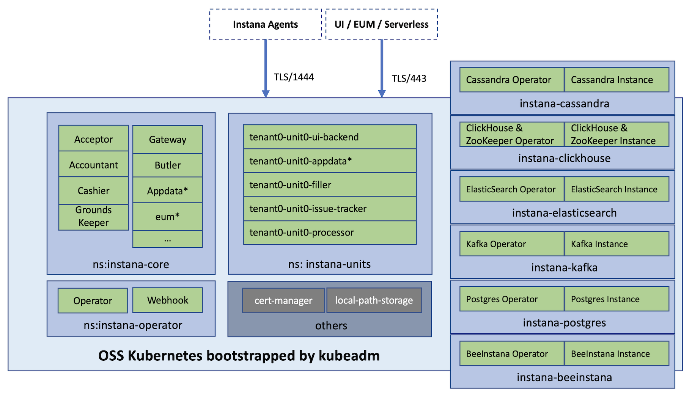

# Instana Server on single-node K8s

This repository guides you through how to set up Instana within a single-VM on Kubernetes, bootstrapped by `kubeadm`, from scratch.

Tested environments and the Instana version used:

- OS on `amd64` / `x86_64` CPU arch:
  - RHEL 8.x
  - Ubuntu 20.04
- on Instana version `253-1`, which is configurable through `export INSTANA_VERSION=<YOUR DESIRED VERSION>`

Please note that there are a couple of beta features turned on by default, as of writing:
- BeeInstana
- Apdex
- Logging
- Automation / Actioin Framework

You may turn some of them off to save some resources, if you want.


## Architecture

The architecture can be illustrated as below:




## Prerequisites

### The VM specs

The VM should meet these minimum specs:
- 16 vCPU
- 64G RAM
- 500G HD (SSD preferred)

Please note that the total of default memory requests exceed **64G** so I've scaled down some components to fit into above specs.
Refer to `manifests/datastore-*.yaml` and [`manifests/core.yaml`](./manifests/core.yaml) for the details.

The current setup's resource utilization can be referred to below output -- so the RAM with 64G is at risk as it's overcommitted to be 141%:

```sh
$ kubectl describe node/itzvsi-550004ghs4-dv3hyjx3
...
  Resource           Requests          Limits
  --------           --------          ------
  cpu                12850m (80%)      8100m (50%)
  memory             60159012Ki (91%)  93421604Ki (141%)
```


### Tools

A series of tools will be installed automatically, which include:
- `kubelet`, with configurable version
- `kubeadm`, with configurable version
- `kubectl`, with configurable version
- `cri-o`, with configurable version
- `kubectl-instana plugin`, with configurable version
- [`yq`](https://github.com/mikefarah/yq)

And, there are some other tools required, which typically have been installed already in the VM.

Anyway, the init process will have a double-check so please make sure they're installed beforehand.
- `curl`
- `openssl`


## The TL'DR guide

Go through below steps within the to-be-server VM.

### 0. Prepare

```sh
# Clone the repo
git clone https://github.com/brightzheng100/instana-server-on-k8s.git
cd instana-server-on-k8s/single-node-k8s

# Make a directory for hosting some working files, which will be ignored by Git
mkdir _wip

# Export required environment variables
export INSTANA_EXPOSED_FQDN="<THE FQDN, e.g. 20.26.139.84.nip.io>"
export INSTANA_AGENT_KEY="<THE LICENSE'S AGENT KEY>"
export INSTANA_DOWNLOAD_KEY="<THE LICENSE'S DOWNLOAD KEY>"
export INSTANA_SALES_KEY="<THE LICENSE'S SALES KEY>"
```

Optionally, you may export more environment variables to influence the installation if that makes sense -- the process will respect the desired changes you want to make.

Please refer to [`scripts/13-init-vars.sh`](./scripts/13-init-vars.sh) for the potential environment variables that can be exported.

<details>
  <summary>Click here to show some examples.</summary>
  
  For example, to change the default Instana console login password, do something like this:

  ```sh
  export INSTANA_ADMIN_PWD=MyCoolPassword
  ```

  Or, to use another desired version of Instana, if available, do something like this:

  ```sh
  export INSTANA_VERSION="253-1-1"
  ```

  > Note: The versioning pattern may be different in different OS'es. For example:
  > - On Ubuntu: 253-1-1
  > - On RHEL: 253_1-1

</details>

Now, the preparation is done, and let's get started!


### 1. Init it

```sh
source 1-init-all.sh
```


### 2. Spin up K8s

If you want to spin up K8s in one shot, do this:

```sh
./2-install-k8s.sh
```

But, I'd highly recommend you do it step by step so you have better chance to troubleshoot.
So, run below commands, well, custom functions actually, one by one instead.

<details>
  <summary>Click here to show the step-by-step commands.</summary>
  
  ```sh
  installing-k8s-tools
  installing-k8s-cri

  bootstrapping-k8s
  progress-bar 1

  getting-ready-k8s

  installing-k8s-cni

  installing-tools
  ```
</details>


### 3. Install Instana

Similarly, if you want to install Instana in one shot, do this:

```sh
./3-install-instana.sh
```

But, I'd highly recommend you do it step by step so you have better chance to troubleshoot.
So, run below commands, well, custom functions actually, one by one instead.


<details>
  <summary>Click here to show the step-by-step commands.</summary>
  
  ```sh
  creating-namespaces
  installing-local-path-provisioner

  installing-cert-manager
  # check before proceeding: wait 5 mins for expected 3 pods
  check-namespaced-pod-status-and-keep-displaying-info "cert-manager" 5 3 "kubectl get pod -n cert-manager"

  installing-datastore-kafka
  installing-datastore-elasticsearch
  installing-datastore-postgres
  installing-datastore-cassandra
  installing-datastore-clickhouse

  installing-beeinstana
  # check before proceeding: wait 10 mins for expected 4 pods
  check-namespaced-pod-status-and-keep-displaying-info "instana-beeinstana" 10 4 "kubectl get pod -n instana-beeinstana"

  installing-instana-operator
  # check before proceeding: wait 8 mins for expected 2 pods
  check-namespaced-pod-status-and-keep-displaying-info "instana-operator" 8 2 "kubectl get pod -n instana-operator"

  installing-instana-server-secret-image-pullsecret
  installing-instana-server-secret-instana-core
  installing-instana-server-secret-instana-tls
  installing-instana-server-secret-tenant0-unit0

  installing-instana-server-core
  # check before proceeding: wait 20 mins for expected 22 more pods
  # Note: this depends on the beta features as well so don't be that exact
  check-namespaced-pod-status-and-keep-displaying-info "instana-core" 20 22 "kubectl get pod -n instana-core"

  installing-instana-server-unit
  # check before proceeding: wait 10 mins for expected 6 pods
  check-namespaced-pod-status-and-keep-displaying-info "instana-units" 10 6 "kubectl get pod -n instana-units"

  exposing-instana-server-services
  ```
</details>


### 4. How to access?

Once you've gone through all above steps successfully, the Instana should have been deployed.
Now, you can print out the access info:

```sh
how-to-access-instana
```

## The Scripts & YAML files

If you really want do dive deeper into the details, please check out the scripts and YAML files accordingly.
